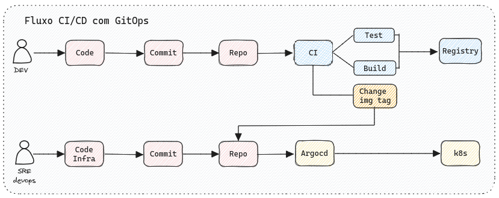

# DevOps Project
This repository contains a mini project which I made to study some tools from the DevOps world.

CI/CD, or continuous integration and continuous delivery, is an essential part of the modern software development life cycle. Coupled with GitOps, CI/CD allows developers to release high-quality software almost as soon as they commit code to a repository such as GitHub.

The core of this project is to create a CI/CD pipeline using GitHub Action and ArgoCD to implement a GitOps scenario. The image below shows us a GitOps scenario that contains two repositories. The first repository is where we have the code of our application and the second is where we have our infrastructure repository.  

The repository that contains the code is: https://github.com/leohauschild/simple-voting-app  
And the second repository which contains the infrastructure code is the same as where I am writing.
# Infraestructure

[Cluster Provision](/provision):  
* For this project, I am using [Kind](https://kind.sigs.k8s.io/) to implement a local Kubernetes Cluster.
* I am using [Terraform](https://www.terraform.io/) to deploy the Kind local Custer.
* On the same Terraform code, I am using [Helm provider](https://registry.terraform.io/providers/hashicorp/helm/latest/docs) on Terraform to install ArgoCD.
* After Terraform deploys all of my resources I start the configurations of [ArgoCD using their CLI](https://argo-cd.readthedocs.io/en/stable/getting_started/).

# CI
Here I will write about CI project...

# CD 
Here I will write about CD project...

